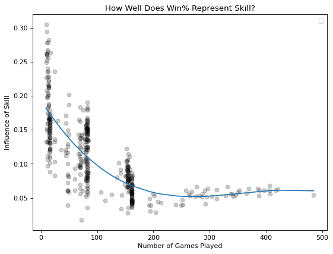

# Estimating Win% Variance Attributable to Skill
How well do season win percentages represent team skill (rather than chance) in various competitive sports leagues?

## Background
Around 2013, [Michael Mauboussin](https://www.worldcat.org/title/success-equation-untangling-skill-and-luck-in-business-sports-and-investing/oclc/840838734&referer=brief_results), [Phil Birnbaum](http://blog.philbirnbaum.com/2013/01/luck-vs-talent-in-nhl-standings.html), and [Julian Ryan & Barrett Hansen](http://harvardsportsanalysis.org/2013/09/undeserving-champions-examining-variance-in-the-postseason/) took a look at a question [Tom Tango](http://www.insidethebook.com/ee/index.php/site/comments/true_talent_levels_for_sports_leagues/) put forward in 2006: how well do final season standings represent team skill, rather than chance? Here, I've responded to this question for a number of sports leagues through their recorded history from their founding to the most recent available season.

If a league's standings have low estimated attributability to skill, that isn't to say that certain professional atheletes aren't skilled—rather, high "chanciness" in team standings implies that everyone is comparably high-skill. For example, a chess grandmaster defeating a novice is highly attributable to a difference in skill, but an outcome between grandmasters is more of a toss-up.

## Collection
### NHL
Collecting NHL historical season data is simple using the [official NHL API](https://records.nhl.com/site/api/franchise-season-records), though only [unofficial documentation](https://gitlab.com/dword4/nhlapi) exists. To reduce the number of requests sent to their servers, my script requests franchise data from all previous NHL seasons once, then organizes it into seasons locally, rather than requesting each of the 100+ past seasons separately.

### NBA, WNBA, NCAABB, NFL, and MLB
I scraped historical season data from the [Sports Reference](https://www.sports-reference.com/) family of sites, which presents data from [Sportsradar](https://sportradar.us/) (an official stats partner of these leagues) in simple-to-parse tables. The web scrapers download the HTML for one season's stats, store the desired stats, then travel to the webpage for the next season and do it again. This is within the bounds of their [terms of service](https://www.sports-reference.com/termsofuse.html) because the scripts don't run in a way that "adversely impacts site performance or access" nor produce a result that "competes with or constitutes a material substitute for the services or data stores offered on the Site".

### NLL
National Lacrosse League standings are hosted by [Pointstreak](https://pointstreak.com/), a Canadian sports technology company. Rather than tagging their records with human-readable years, they use unique ID numbers, which are defined in the source code for the NLL season standings page. While the list is short enough to copy and clean by hand, I wrote a script to scrape them, which future-proofs the list of codes to a certain extent by allowing future seasons to be added automatically later.

## Transformation
The key equation is ````var(x+y) = var(x) + var(y) + 2*Cov(x,y)```` as ````var(record) = var(skill) + var(luck)````, where ````var(record)```` is the variance of the teams' wins out of games played, and ````var(luck)```` is the variance we would expect for randomly determined outcomes—for example, if teams just flipped a coin to determine the outcome of each match. We will work with the assumption that skill and luck are mutually independent, so the the covariance ````Cov(x,y)```` between skill and luck is 0. In general, greater variance attributable to skill suggests season standings better represent team skill.

## Visualization
With the season year on the horizontal axis and the number representing how well a season's final standings represent team skill on the vertical axis, it's possible to find a trend line for the role of skill in season standings over time for a given league. We can compare those trends at a glance to determine which league's standings have been more likely to represent team skill.


And to take a look at whether increasing the number of games played makes a difference, or if differences between how each sport is played are more to blame: 



## Interpretation
It's no suprise that MLB standings are least and WNBA/NBA standings are most attributable to skill. As Michael Mauboussin notes, nearly every player on an MLB team is required to bat, while in basketball, it's possible to tell four players to just pass to the team all-star when they gain possession. The wider variance in baseball player skill within a team regresses team standings toward the mean, while a basketball MVP is able to carry their team and make up for their more average teammates.

Note also the consistent increase in chanciness in NFL standings, particularly the shift in the late 1970s, which is likely due to various [rules changes](https://operations.nfl.com/the-rules/evolution-of-the-nfl-rules/) established in the 1978 and 1979 seasons.

The high chanciness in NCAA basketball standings likely contributes to the massive popular interest in March Madness predictions. Not only are single-elimination tournaments highly chancy, but a chancy regular season makes accurate predictions even more difficult.

<!--
## Presentation
-->
