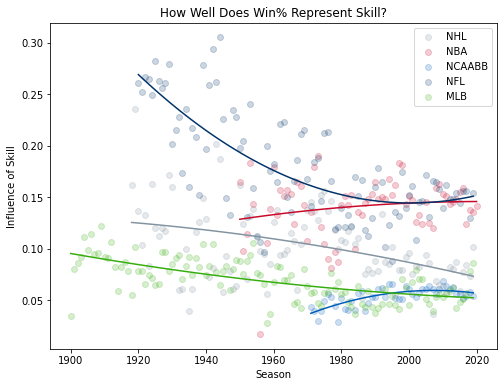

# Estimating Win% Variance Attributable to Skill
How well do season win percentages represent team skill (rather than chance) in various competitive sports leagues?

<!-- ## Background -->

## Collection
### NHL
Collecting NHL historical season data is simple using the [official NHL API](https://records.nhl.com/site/api/franchise-season-records), though only [unofficial documentation](https://gitlab.com/dword4/nhlapi) exists. To reduce the number of requests sent to their servers, my script requests franchise data from all previous NHL seasons once, then organizes it into seasons locally, rather than requesting each of the 100+ past seasons separately.

### NBA, WNBA, NFL, and MLB
I scraped historical season data from the [Sports Reference](https://www.sports-reference.com/) family of sites, which presents data from [Sportsradar](https://sportradar.us/) (an official stats partner of these leagues) in simple-to-parse tables. The web scrapers download the HTML for one season's stats, store the desired stats, then travel to the webpage for the next season and do it again. This is within the bounds of their [terms of service](https://www.sports-reference.com/termsofuse.html) because the scripts don't run in a way that "adversely impacts site performance or access" nor produce a result that "competes with or constitutes a material substitute for the services or data stores offered on the Site".

## Transformation
The key equation is ````var(x+y) = var(x) + var(y) + 2*Cov(x,y)```` as ````var(record) = var(skill) + var(luck)````, where ````var(record)```` is the variance of the teams' wins out of games played, and ````var(luck)```` is the variance we would expect for randomly determined outcomes—for example, if teams just flipped a coin to determine the outcome of each match. We will work with the assumption that skill and luck are mutually independent, so the the covariance ````Cov(x,y)```` between skill and luck is 0. In general, greater variance suggests the outcomes better represent team skill.

## Visualization
With the season year on the horizontal axis and the number representing how well a season's final standings represent team skill on the vertical axis, it's possible to find a trend line for the role of skill in season standings over time for a given league. We can compare those trends at a glance to determine which league's standings have been more likely to represent team skill.



<!--
## Interpretation

## Presentation
-->
